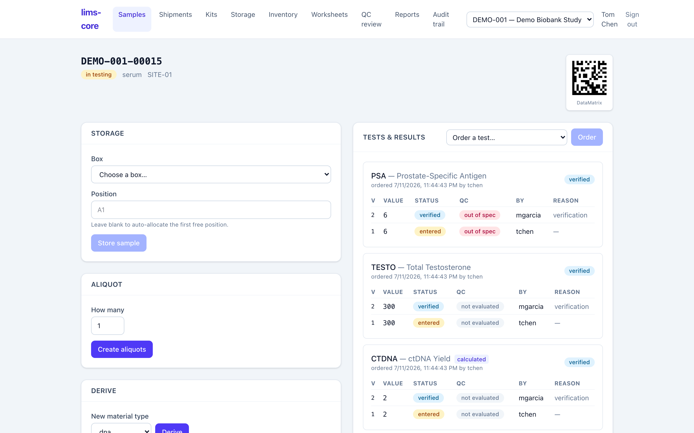

# lims-core

A modern, open-source **Laboratory Information Management System** for clinical
research — biospecimen/biobank management for trials first, with a
domain-neutral core designed to also serve analytical labs. Third sibling to
[`edc-core`](../edc-core) (Electronic Data Capture) and
[`ctms-core`](../ctms-core) (Clinical Trial Management); the three are
converging onto one interoperable platform.

Compliance is structural, not bolted on: 21 CFR Part 11 append-only audit and
e-signatures, plus specimen chain of custody, enforced in PostgreSQL via
triggers and a least-privilege application role — never trusted to application
code.

**Documentation & user guide:** <https://tgerke.github.io/lims-core/>



> **Status:** a broad, working build across the biobank and analytical
> workflows, on a production-shaped compliance core — but not yet a validated
> production system, and not a drop-in replacement for a commercial LIMS. See
> the [completeness review](docs/completeness-review.md) for an honest,
> code-checked gap analysis.

## What works today

The original vertical slice — accession → DataMatrix label → freezer storage →
order → versioned four-eyes result → password-step-up e-signature →
hash-chained audit trail you can verify — now sits inside a much wider surface:

- **Biobank operations.** Aliquot and derivation lineage with conserved
  volume/quantity, single-parent derivation and many-parent pooling, freeze-thaw
  counts and concentration; consent-withdrawal holds (sample- or subject-wide,
  propagated to descendants) and terminal supervisor-only disposal.
- **Logistics.** Shipments with a pack → ship → receive custody handoff,
  outbound collection kits, count-based bulk accessioning, CSV manifest import,
  and an interactive freezer map with click-to-place/move.
- **Analytical / QC.** Per-service acceptance criteria evaluated at result
  entry, calculated results via a safe expression engine, worksheets/runs that
  consume reagent lots, QC control samples with single- and multi-observation
  Westgard rules, a run-level QC release gate, Certificate-of-Analysis PDFs, and
  a QC review board with Levey-Jennings trending.
- **Inventory & reporting.** A lab-wide reagent/lot catalog with an append-only
  consumption ledger, plus study-scoped inventory counts, turnaround metrics,
  and a PHI-free manifest CSV.

All of it runs front-to-back with OIDC or password auth, grant-based RBAC scoped
to study/site, and a per-study append-only audit chain. Every regulated behavior
lands with an ADR (`docs/adr/`) and a compliance test.

## Stack

pnpm workspaces · TypeScript 5.6 ESM · Fastify 5 + Zod 4 · Drizzle + PostgreSQL
16 · React 19 + Vite + TanStack + Tailwind · Biome · Vitest. See
[`docs/adr/0001`](docs/adr/0001-convergent-stack.md) for why.

## Quick start

```sh
podman compose -f infra/compose.yaml up -d postgres   # Postgres 16 on :5434
pnpm install
pnpm --filter @lims-core/db db:migrate
pnpm --filter @lims-core/api db:seed-demo             # demo study, site, users
pnpm dev                                              # api :3001, web :5174
```

Open http://localhost:5174 and sign in as `tchen` / `lims-demo-2026!`
(technician) to accession and store; `mgarcia` / `lims-demo-2026!`
(lab manager) to verify and sign.

## Layout

```
apps/api          Fastify API: auth, RBAC, domain routes, compliance tests
apps/web          React SPA: samples, storage, shipments, kits, inventory,
                  worksheets, QC review, reports, audit
packages/db       Drizzle schema + hand-written SQL migrations (triggers/roles)
packages/core     Audited domain logic: withActor, custody, storage, aliquots,
                  shipments, inventory, results, QC/Westgard, esign
packages/schemas  Zod contracts shared client + server
packages/labels   DataMatrix + accession-ID generation (bwip-js)
docs/             plan, ADRs, regulatory-traceability matrix
```

## Compliance guarantees (all tested)

Direct `UPDATE`/`DELETE` on `audit_event` / `result` / `custody_event` /
`signature` fail by trigger; the runtime role cannot forge an audit event; a
tampered event fails `lims_verify_audit_chain()`; e-signing rejects a wrong
password. Each test cites its requirement ID —
see [`docs/regulatory-traceability.md`](docs/regulatory-traceability.md).

## Documentation

- [User guide & walkthrough](https://tgerke.github.io/lims-core/) (GitHub Pages)
- [Completeness review](docs/completeness-review.md) — vs. a CRO/pharma LIMS
- [Build plan & architecture](docs/plan.md)
- [Regulatory traceability matrix](docs/regulatory-traceability.md)
- [Architecture decision records](docs/adr/)

## License

AGPL-3.0-only.
