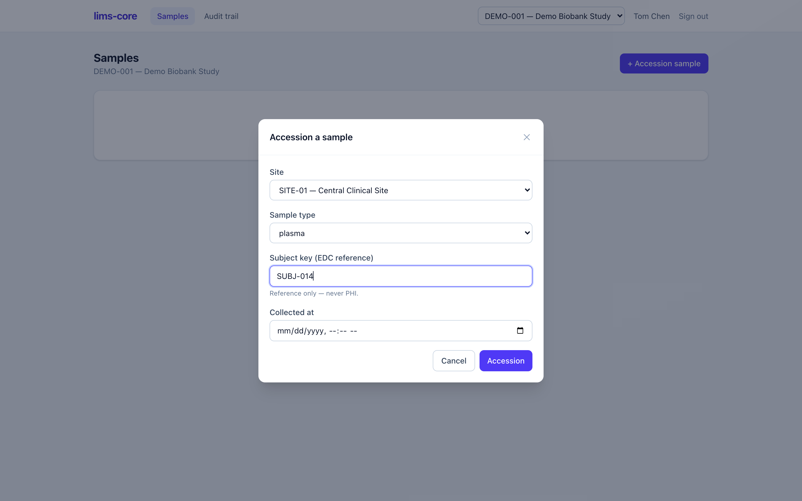

Accessioning is where a specimen enters the system. Registering it creates the
sample record, assigns a per-study accession ID, and opens the chain of custody
— all in a single database transaction, so a specimen is never half-registered.

## The samples list

Each study has a filterable list of its specimens: accession ID, type, workflow
status, subject reference, site, storage location, and receipt time. It is the
home base you return to after every action.

{.screenshot fig-alt="lims-core samples list showing accession IDs, specimen types, statuses, and storage locations"}

## Registering a specimen

Register a new specimen against a study and site and choose its type — whole
blood, serum, plasma, tissue, urine, DNA, RNA, or other. The "other" type keeps
the core domain-neutral so the same system can handle analytical samples later.

{.screenshot fig-alt="lims-core accession form with site, specimen type, and optional subject reference fields"}

You can optionally link the EDC subject and study event (visit) the specimen was
collected from. This is a **reference only**: the subject key and event OID are
identifiers that point back to the EDC, never patient health information. No
subject-level clinical data enters the LIMS.

::: {.callout-note}
The moment you accession, two custody events are written — collection and
receipt — and the specimen's history begins. There is no separate "start
tracking" action; custody opens with the specimen (requirement CoC-01).
:::

Once accessioned, the specimen is ready to be
[labeled and stored](storage-and-custody.qmd).
