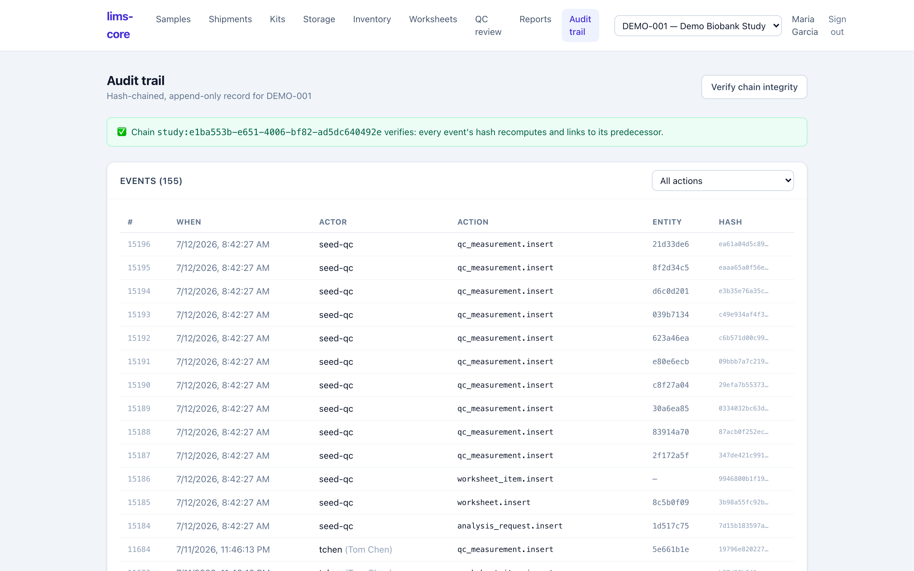

Every write to a regulated table — samples, custody, shipments, results, QC
measurements, signatures, and more — lands in an append-only audit trail.
Nothing the application does escapes it, because the trail is written by database
triggers, not by application code that could forget or be bypassed.

{.screenshot fig-alt="lims-core audit trail showing a chronological list of events with a chain-integrity verification result"}

## Reading it

The trail is a filterable feed of events, each showing what changed, who did it,
and when. Access is attributed to the acting user on every row — a write that
somehow happened outside an attributed action would show as `system`, which is
itself a signal worth investigating.

The trail is scoped **per study**: each study has its own chain. That scoping is
deliberate (see
[ADR-0002](https://github.com/tgerke/lims-core/blob/main/docs/adr/0002-per-study-audit-chain.md))
and is why custody events carry their study reference directly.

## Verifying the chain

Each event stores a hash of its own contents plus the hash of the event before
it — a hash chain. Change any past event and every event after it stops
matching, so tampering is detectable rather than silent (requirement P11-03).

The **Verify chain integrity** button recomputes the entire chain and reports
whether it holds. Anyone with review rights can run it, at any time, to prove
the record has not been altered after the fact. It is the difference between "we
log changes" and "we can prove the log is intact."

::: {.callout-note}
The runtime application role cannot insert audit rows at all, and direct
`UPDATE` or `DELETE` on the audit table fails by trigger. There is no path — not
even a buggy one — for the application to forge or rewrite history. The
[compliance page](../compliance.qmd) lists the tests that prove this.
:::
