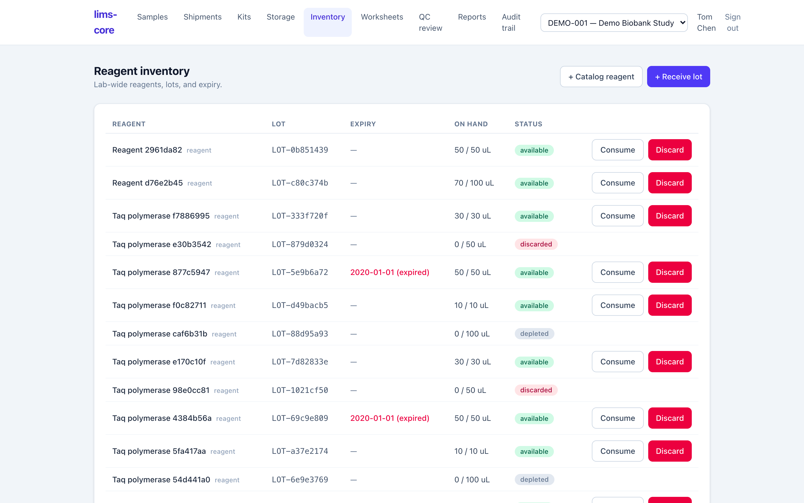

Reagents and consumables are lab resources, not study assets, so inventory is
tracked **lab-wide** rather than per study. The inventory screen is a catalog of
reagents, the lots received against them, and an append-only ledger of what each
run consumed.

{.screenshot fig-alt="lims-core reagent inventory listing reagents and lots with expiry dates, on-hand quantities, and available, expired, depleted, and discarded statuses"}

## Catalog, lots, and the consumption ledger

Three layers make up the inventory (ADR-0016):

- A **catalog** of reagents and consumables — the named materials the lab uses.
- **Lots** received against a reagent, each with a lot number, expiry date, and
  on-hand quantity.
- A **consumption ledger** that records every draw from a lot. The ledger is
  append-only: usage is never edited away, only added to, and a lot's on-hand
  quantity is the received amount minus everything the ledger has drawn.

Consumption is guarded. A draw is rejected if the lot is expired, quarantined,
or discarded, or if it would over-draw the remaining quantity; a lot depletes to
zero rather than going negative. Because the ledger links to the worksheet run
that consumed it, a reagent lot and the assay results it produced are traceable
to each other — see [analytical testing](analytical-testing.qmd).

::: {.callout-note}
Inventory writes are audited to the **`global`** chain rather than a study chain,
because reagents are not study-scoped, and the actions are authorized on an
`inventory.manage` authority a user can hold in any study (ADR-0016). Par-level
reorder alerts are not built yet — see the [roadmap](../roadmap.qmd).
:::
