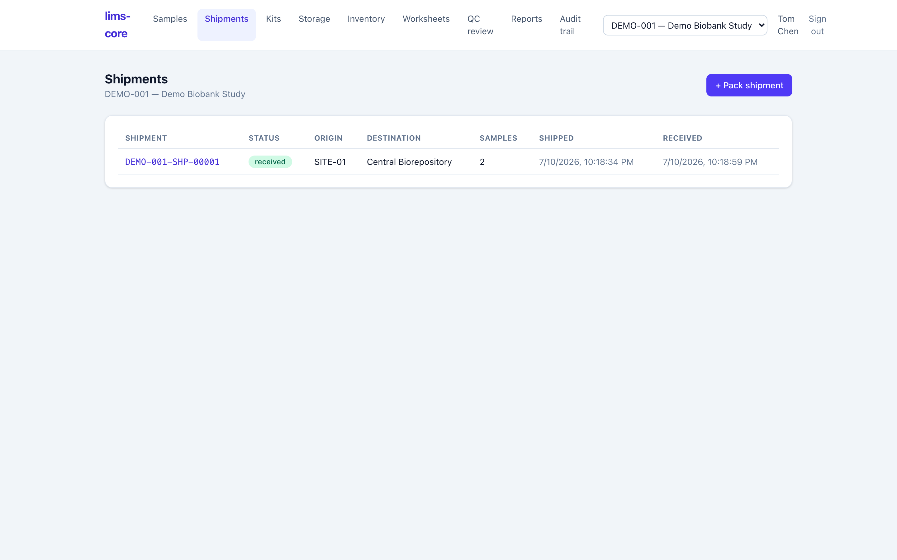
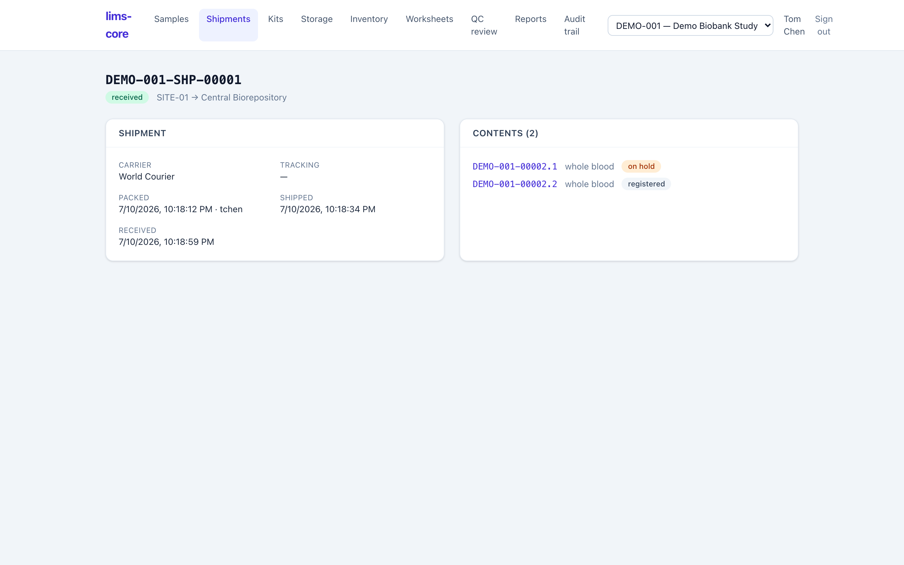
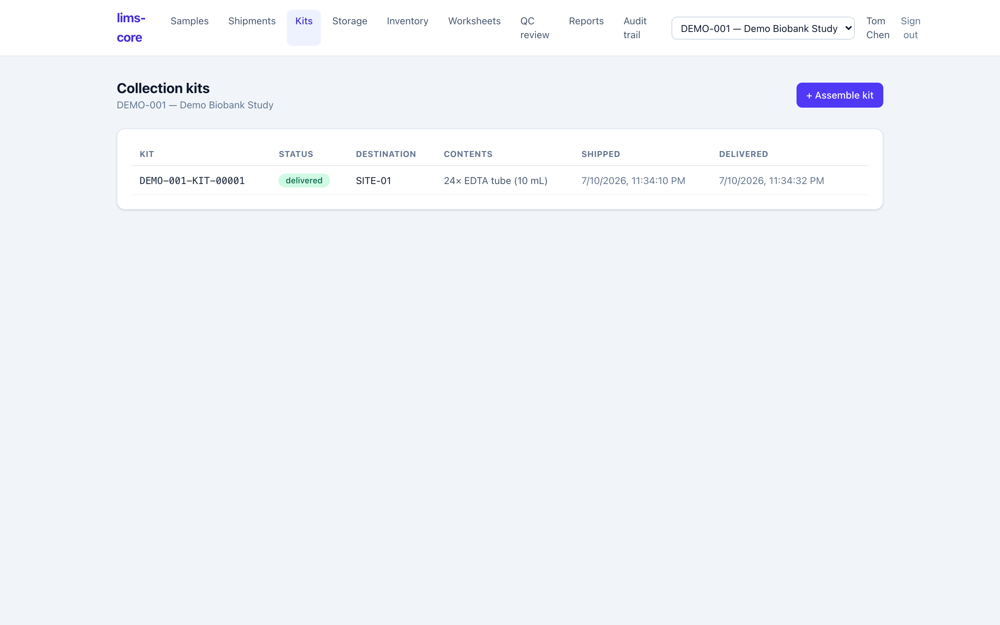

Specimens collected at a site have to reach the central lab, and the sites need
supplies to collect them in the first place. Both journeys are tracked as custody
events, so the record answers "who had this, and when" across the handoff
between organizations — not just within one freezer room.

## Shipments: the custody handoff

{.screenshot fig-alt="lims-core shipments list showing a shipment with its status, origin, destination, sample count, and shipped and received times"}

A shipment moves a batch of specimens from one location to another through three
recorded phases (requirement CoC-06, ADR-0007):

1. **Pack** — assemble the specimens into a shipment, with a carrier and optional
   tracking number.
2. **Ship** — mark it in transit; the specimens are now in a transfer state.
3. **Receive** — the destination confirms arrival.

Each phase writes a `transfer` custody event on every specimen in the batch, and
the packing and receiving are **separated**: the sender and the receiver are
distinct steps, so the chain shows an unbroken hand-to-hand transfer rather than
a single unverified jump.

{.screenshot fig-alt="lims-core shipment detail showing origin and destination, packed, shipped and received timestamps, and the specimens in the shipment"}

## Collection kits

Kits run the same lifecycle in the other direction — outbound, empty containers
sent *to* a site so it can collect specimens (ADR-0011):

- **Assemble** a kit with its contents (for example, 24 EDTA tubes),
- **Ship** it to a destination site,
- **Deliver** it, confirming arrival.

The kit carries an audited lifecycle from assembly to delivery, so a study
coordinator can see which sites have collection supplies and when they arrived.

{.screenshot fig-alt="lims-core collection kits list showing a kit, its status, destination site, contents, and shipped and delivered times"}

::: {.callout-note}
Kit → collected-sample linkage and par-level kit inventory are not built yet —
see the [roadmap](../roadmap.qmd). Today a kit tracks the outbound container; the
specimens collected into it are accessioned as their own records.
:::
