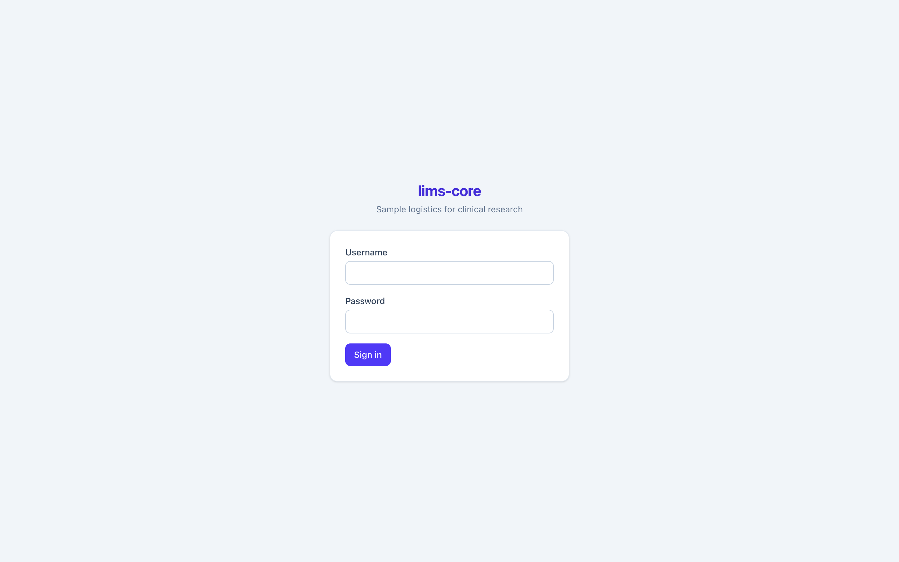
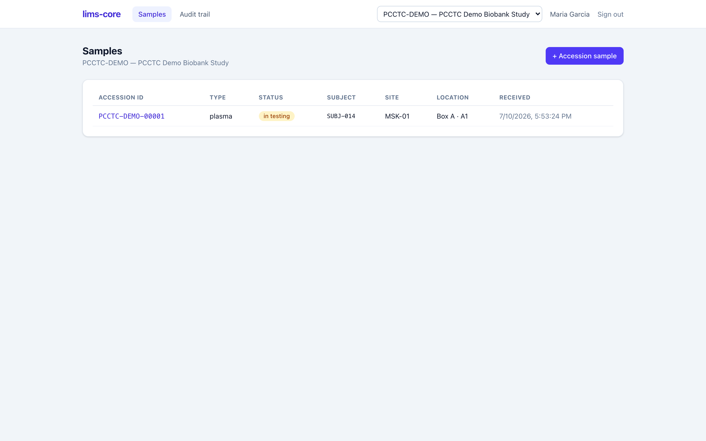
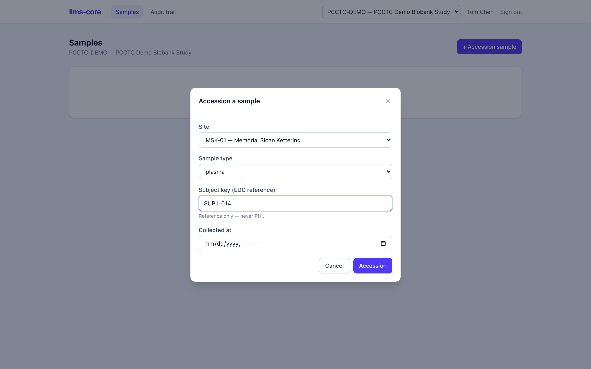
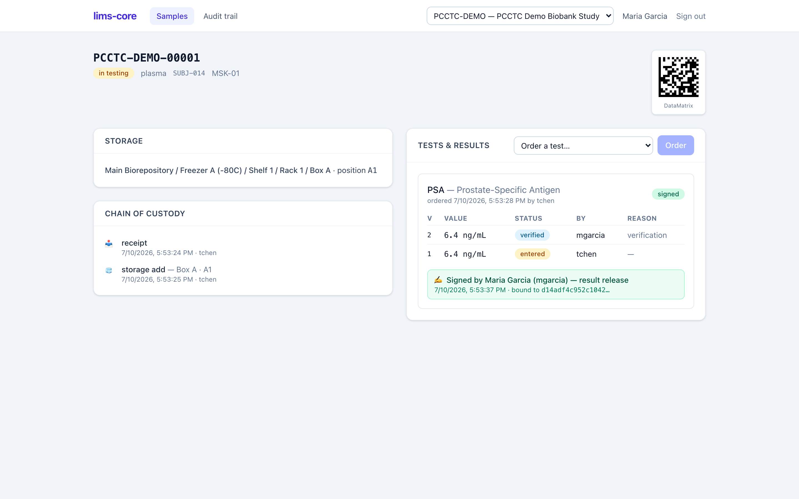
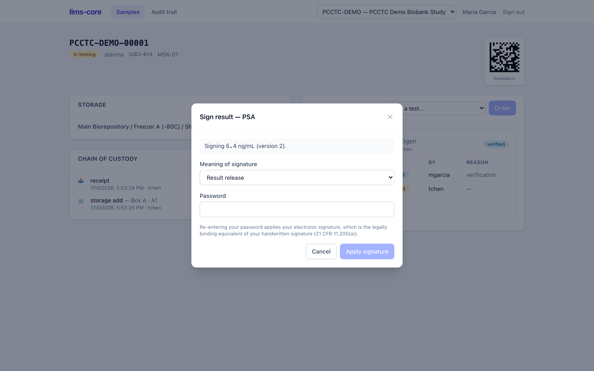

# lims-core

**An open-source Laboratory Information Management System for clinical research.**
Biospecimen/biobank management for trials first, with a domain-neutral core
designed to also serve analytical labs. Compliance is structural, not bolted on:
a tamper-evident audit trail, re-authenticated e-signatures, and specimen chain
of custody are enforced in PostgreSQL — never trusted to application code.

> **Where this is in its life.** lims-core is at its first end-to-end milestone:
> one workflow, working front-to-back, on a production-shaped compliance core.
> It is a strong foundation and a working demo, **not yet a production system**
> for running a regulated biobank, and **not a drop-in LabVantage replacement**.
> The honest, detailed gap analysis is in the
> [completeness review](completeness-review.md) — read it before planning any
> deployment.

---

## The workflow, end to end

Everything below is the actual application. One specimen travels from receipt to
a signed, verifiable result, and every step writes to an immutable audit trail.

### 1. Sign in

Sign in with single sign-on (OIDC) or a local password. Access is granted per
study and site, and your role decides what you can do — a receiving-desk
accessioner, a bench technician, a lab manager who verifies and signs, or a
read-only monitor.



### 2. See your samples

Each study has a filterable list of its specimens — accession ID, type, workflow
status, subject reference, site, storage location, and receipt time.



### 3. Accession a specimen

Register a new specimen against a study and site, choose its type (whole blood,
serum, plasma, tissue, urine, DNA, RNA, …), and optionally link the EDC subject
it was collected from. The subject key is a **reference only** — no patient
health information ever enters the LIMS. Accessioning opens the chain of custody
and writes the first audit events in the same transaction.



### 4. Label, store, order, and result

The sample record brings the whole lifecycle onto one screen:

- a scannable **2D DataMatrix label** with a human-readable accession ID;
- **storage** into a freezer position (facility → freezer → shelf → rack → box),
  with one specimen per position enforced by the database;
- a running **chain of custody** (receipt, storage, transfers…);
- **tests and results** — order an analysis, then enter a result. Results are
  versioned and append-only: a correction adds a new version with a required
  reason, and the original value is never overwritten.



Results follow a **four-eyes** rule: the person who enters a result cannot
verify their own work. A lab manager reviews and verifies, which is what
promotes the result toward release.

### 5. E-sign the result

Releasing a verified result requires an electronic signature. The signer
re-enters their password (a step-up re-authentication), states the meaning of
the signature, and the signature is cryptographically bound to the exact result
version it approves. It cannot be edited, moved to another record, or carried
forward onto a later version — only invalidated, on the record, with a reason.



### 6. Review the audit trail

Every write to a regulated table — samples, custody, results, signatures — lands
in a hash-chained, append-only audit trail, scoped per study. Anyone with review
rights can filter it and, with one click, **recompute the whole chain** to prove
nothing has been altered after the fact.


---

## Who does what (roles)

Access is grant-based and scoped to a study (optionally to a single site).

| Role | Can |
| --- | --- |
| **Lab admin** | Everything within a study, including granting roles. |
| **Lab manager** | Manage the study; verify and sign results; review the audit trail. |
| **Technician** | Accession and store samples; order tests; enter results. |
| **Accessioner** | Accession and store samples only. |
| **Monitor** | Review audit trails and custody records (external reviewer). |
| **Read-only** | Read access through study membership; no actions. |

System administrators hold no laboratory authority — administering the platform
is deliberately separate from clinical/lab work.

---

## Try it locally

You need [Podman](https://podman.io/) (or Docker), Node ≥22, and
[pnpm](https://pnpm.io/).

```sh
podman compose -f infra/compose.yaml up -d postgres   # Postgres 16 on :5434
pnpm install
pnpm --filter @lims-core/db db:migrate
pnpm --filter @lims-core/api db:seed-demo             # demo study, site, users
pnpm dev                                              # api :3001, web :5174
```

Open <http://localhost:5174> and sign in with one of the seeded demo accounts:

| User | Password | Role |
| --- | --- | --- |
| `tchen` | `lims-demo-2026!` | Technician — accession, store, order, enter results |
| `mgarcia` | `lims-demo-2026!` | Lab manager — verify and sign |
| `rpatel` | `lims-demo-2026!` | Accessioner |
| `admin` | `lims-admin-2026!` | Lab admin + system admin |

Demo passwords are printed by the seed script and are for local development
only. Never seed a real deployment with them.

---

## Compliance guarantees (all tested)

Each control below is enforced in the database and proven by an automated test
that cites its requirement ID. Full mapping in the
[regulatory traceability matrix](regulatory-traceability.md).

- The audit trail cannot be altered or fabricated — direct `UPDATE`/`DELETE`
  fail, and the application's runtime role cannot insert audit rows at all.
- A tampered event fails the chain-integrity check.
- Results are append-only and versioned; corrections keep the prior value and
  require a reason.
- Signatures re-authenticate the signer, state their meaning, and are bound to
  the signed record.
- A signature with the wrong password is rejected.

> **Grounding rule.** This project never restates a regulation from model
> memory. Every compliance claim traces to enforced behavior and a test; where
> source text matters, it is cited, not paraphrased. See the
> [project house rules](https://github.com/tgerke/lims-core/blob/main/CLAUDE.md).

---

## Dig deeper

- [Build plan & architecture](plan.md)
- [Completeness review — what's here, what's not, and how far from LabVantage](completeness-review.md)
- [Regulatory traceability matrix](regulatory-traceability.md)
- Architecture decision records:
  [convergent stack](adr/0001-convergent-stack.md) ·
  [per-study audit chain](adr/0002-per-study-audit-chain.md) ·
  [password step-up e-sign](adr/0003-password-step-up-esign.md) ·
  [labels library](adr/0004-labels-library.md)
- [Source on GitHub](https://github.com/tgerke/lims-core)

lims-core is the third sibling to `edc-core` (Electronic Data Capture) and
`ctms-core` (Clinical Trial Management); the three are converging onto one
interoperable platform. Licensed **AGPL-3.0-only**.
