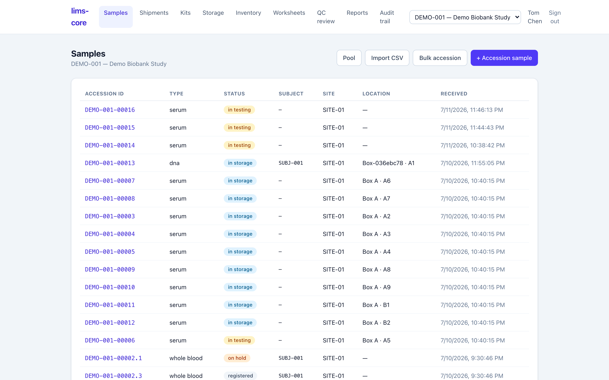

Accessioning is where a specimen enters the system. Registering it creates the
sample record, assigns a per-study accession ID, and opens the chain of custody
— all in a single database transaction, so a specimen is never half-registered.

## The samples list

Each study has a filterable list of its specimens: accession ID, type, workflow
status, subject reference, site, storage location, and receipt time. It is the
home base you return to after every action.

## Registering a specimen

Register a new specimen against a study and site and choose its type — whole
blood, serum, plasma, tissue, urine, DNA, RNA, or other. The "other" type keeps
the core domain-neutral so the same system can handle analytical samples later.

You can optionally link the EDC subject and study event (visit) the specimen was
collected from. This is a **reference only**: the subject key and event OID are
identifiers that point back to the EDC, never patient health information. No
subject-level clinical data enters the LIMS.

:::note
The moment you accession, two custody events are written — collection and
receipt — and the specimen's history begins. There is no separate "start
tracking" action; custody opens with the specimen (requirement CoC-01).
:::

## Accessioning in bulk

The samples list offers three faster paths for a real receiving desk, next to
the single-specimen form:

- **Bulk accession** registers a count of identical specimens in one action —
  same study, site, type, and subject — with an option to fill sequential box
  positions as they are created (ADR-0008). Every specimen still gets its own
  accession ID and custody events.
- **Import CSV** accessions a heterogeneous batch from a manifest, one row per
  specimen with its own subject, type, and collection time. The file is
  validated server-side and applied **all-or-nothing**: if any row is bad, the
  whole import is rejected with a per-row error report, so a batch never lands
  half-applied (ADR-0012).
- **Pool** combines several parent specimens into one pooled sample, recording
  the many-to-one lineage — see [biobank operations](/lims-core/user-guide/biobank-operations/).

Once accessioned, a specimen is ready to be
[labeled and stored](/lims-core/user-guide/storage-and-custody/).
