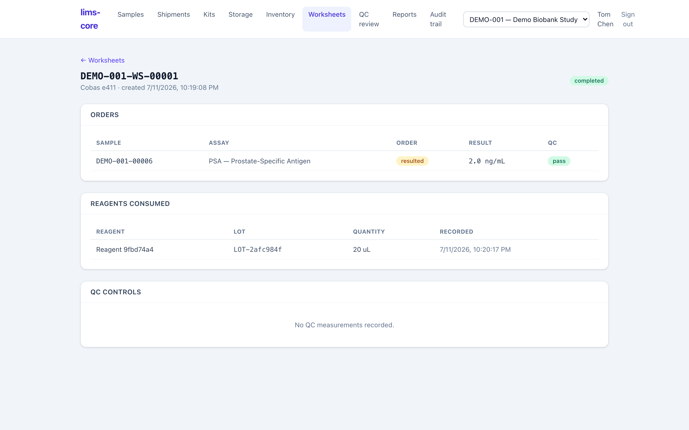

Beyond storing specimens, lims-core runs assays on them. The analytical layer
sits on the same core as the biobank workflow: a worksheet batches orders into
an instrument run, the run draws down reagent lots, results are checked against
specifications, and a passing run can be released as a certificate. Everything
here is audited and versioned like the rest of the system.

## Worksheets and runs

A **worksheet** groups analysis orders into a run that moves through
`draft` → `in_progress` → `completed` (ADR-0018). It is the batch an analyst
actually works: the samples on the bench together, the assay they share, and the
reagents they consume.

## Reagent consumption

Recording a run's reagent use draws from a lot through the append-only
[inventory](/lims-core/user-guide/inventory/) consumption ledger, and links the worksheet to the
exact ledger row it drew from. That link is the seam between QC and inventory: a
result is traceable to the specific reagent lot that produced it, and a lot's
remaining quantity reflects every run that touched it (ADR-0018).

## Specifications and calculated results

Results entered on a run are evaluated against each service's
[acceptance criteria](/lims-core/user-guide/orders-and-results/) and stamped `pass`,
`out_of_spec`, or `not_evaluated` (ADR-0017). Services can also be **calculated**
— their value derived from other results via a safe server-side expression
(ADR-0020) — so a computed yield or ratio is produced and versioned without
manual arithmetic.

## The QC release gate

Release is gated on quality control. A run's results cannot be released while its
QC controls are out of control: the gate keys on the control material and holds
the whole run's results back until QC passes (ADR-0021). This is why QC lives
next to the run rather than as a separate afterthought — see
[quality control](/lims-core/user-guide/quality-control/) for the control samples and Westgard
rules behind the verdict.

## Certificate of Analysis

Once a sample's results are complete and released, a **Certificate of Analysis**
can be issued: a point-in-time PDF snapshot of the sample, its results, and their
QC status, generated on demand (ADR-0022). The certificate is content-hashed and
recorded, so an issued certificate is tied to exactly the results it reported.

:::note
Instrument integration (direct capture from analysers), control-type
distinctions, and the cross-level within-run Westgard rules are not built yet.
The [roadmap](/lims-core/roadmap/) is specific about what remains.
:::
