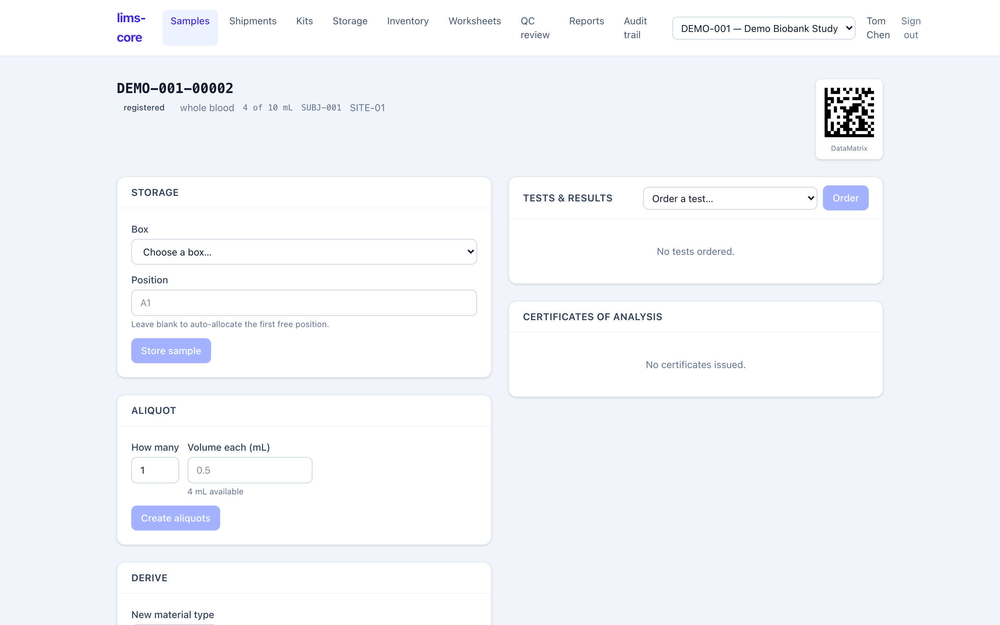

A biobank rarely stores a specimen and leaves it alone. It splits it into
working aliquots, derives new material from it, pools several specimens
together, and sometimes has to pull one from circulation when consent is
withdrawn. Each of these actions runs from the sample record, and each writes
its own lineage and custody so the physical history stays complete.

## Aliquots and volume

A specimen can carry a tracked **quantity** (for example, 10 mL of whole blood).
Creating aliquots draws from that quantity: you say how many children and how
much each takes, and the volume is conserved — the parent is deducted by what
the children remove, and is marked depleted when it reaches zero (requirement
CoC-04, ADR-0006). Each child gets a parent-suffixed accession ID (like
`DEMO-001-00002.1`), a `sample_lineage` link back to its parent, and its own
`aliquot` custody event.

Specimens also track **freeze-thaw count** and **concentration**, so a record
carries the handling detail an analyst needs to judge whether the material is
still fit for an assay (ADR-0013).

## Derivation and pooling

Two lineage shapes beyond simple aliquoting are supported (ADR-0014):

- **Derivation** produces a new material *type* from one parent — DNA from whole
  blood, say. The child is a different specimen type, linked to its single
  parent.
- **Pooling** combines *many* parents into one pooled sample, recording the
  many-to-one lineage. Start it with **Pool** on the samples list.

Both are audited in `sample_lineage` with matching custody events, so a derived
or pooled sample can always be traced back to every specimen that contributed to
it.

## Consent-withdrawal holds and disposal

When a subject withdraws consent, their material has to stop moving. A **hold**
can be placed on a single sample or on a whole subject, and it propagates to
every descendant in the lineage — aliquots and derivatives included (requirement
CoC-05, ADR-0009). While a sample is on hold, the system blocks storing,
aliquoting, and shipping it.

A hold is reversible: releasing it returns the sample to its prior status.
**Disposal** is not — it is a terminal, supervisor-only action that ends the
specimen's life in the biobank, recorded as its own custody event. The
separation is deliberate: an ordinary handler can hold, but only a supervisor
can dispose.

:::note
Every action on this page — each aliquot, derivation, pool, hold, release, and
disposal — appends to the [chain of custody](/lims-core/user-guide/storage-and-custody/) and the
[audit trail](/lims-core/user-guide/audit-trail/). None of them edits an existing row; the record
only ever grows.
:::
