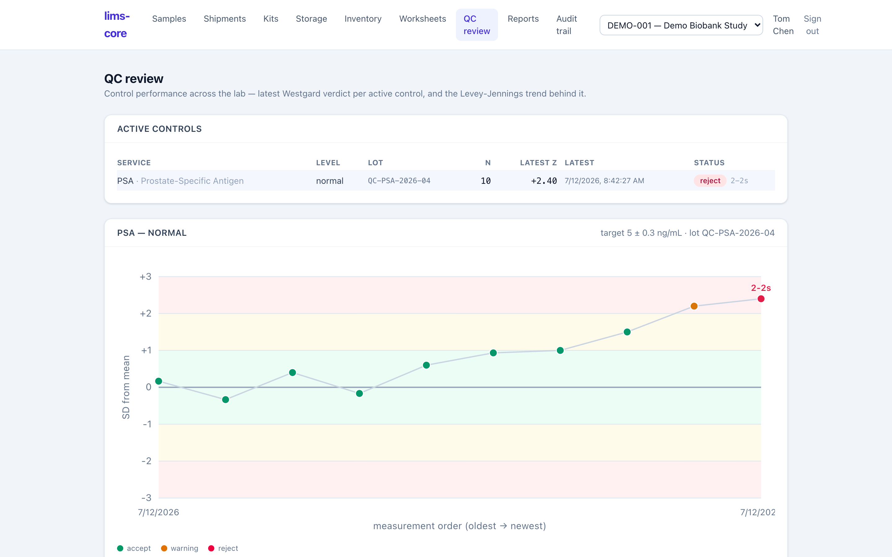

Quality control decides whether a run's results can be trusted. lims-core runs
control materials alongside patient samples, evaluates each measurement against
Westgard rules, feeds the verdict into the [release gate](/lims-core/user-guide/analytical-testing/),
and gives the lab manager a board and a trend chart to review control
performance over time.

## Control samples and Westgard rules

A **control material** is a sample with a known target and standard deviation
run on a worksheet like any other. When a control measurement is recorded, the
system converts it to a **z-score** (how many SDs from target) and evaluates
Westgard rules against the control's recent history:

- **Single-point** rules on one measurement — a 1-2s warning when a point lands
  beyond ±2 SD, a 1-3s rejection beyond ±3 SD (ADR-0019).
- **Multi-observation** rules that look back across the control's prior points
  keyed on the same control material — for example a same-side 2-2s rejection
  when two consecutive points fall beyond ±2 SD on the same side (ADR-0023).

The verdict — `accept`, `warning`, or `reject` — is what the run-level QC gate
reads when deciding whether results may be released.

## The QC review board and Levey-Jennings

The **QC review** screen is a read-only, lab-wide view of control performance. A
board lists every active control with its latest verdict, the rule that fired,
its z-score, and how many measurements back it. Below it, a **Levey-Jennings**
chart plots one control's measurements over time against ±1 / ±2 / ±3 SD bands,
colouring each point by its verdict and annotating the rule at any rejection.

:::note
QC review introduces **no new writes and no new authority** (ADR-0024). It reads
the same frozen measurements the release gate uses, so reviewing a trend can
never alter a record — it only shows what QC already decided.
:::

The chart reads the measurements exactly as recorded, in order, so what a
reviewer sees is the same history the gate acted on — the drift that warned,
then the point that rejected, are the same events, not a recomputed summary.
