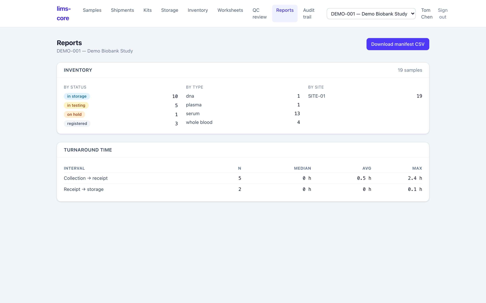

The reports screen answers the everyday operational questions about a study's
biobank — how many specimens, of what type, where, and how fast they moved
through receipt and storage — and exports a manifest for downstream use.

## Inventory counts and turnaround

Two study-scoped summaries (ADR-0010):

- **Inventory** — a count of the study's specimens broken down by workflow
  status, specimen type, and site.
- **Turnaround time** — the median, average, and maximum for two intervals,
  collection → receipt and receipt → storage, computed from the custody events
  those steps wrote. The metrics come straight from the append-only custody log,
  so they measure what actually happened, not a separately maintained tally.

## Manifest export

**Download manifest CSV** exports the study's specimens as a flat file for
downstream use. Like every reference in the system, the manifest is **PHI-free**:
it carries accession IDs, types, statuses, and the EDC subject *reference*, never
patient health information.

:::note
Assay turnaround, trend charts, dashboards, and ad-hoc query are not built yet.
The reports here are the operational counts and exports a coordinator needs
day-to-day; the [roadmap](/lims-core/roadmap/) covers the analytics still ahead.
:::
