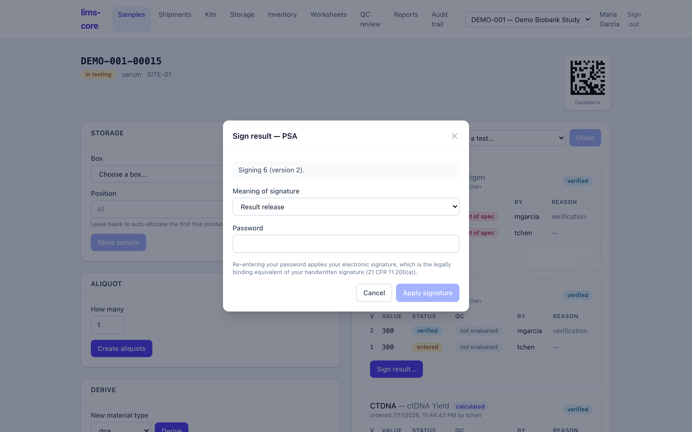

Releasing a verified result requires an electronic signature. Signing is
deliberately a distinct, deliberate act — not something that happens because you
have a live session.

## Password step-up

To sign, the signer re-enters their password — a step-up re-authentication that
re-establishes identity at the moment of signing (requirement P11-12). A wrong
password is rejected, and failed attempts count toward account lockout exactly
like failed logins.

:::caution
A single-sign-on-only account with no local password **cannot sign** until one
is set. This is a deliberate choice: signing works offline from the identity
provider, at the cost of requiring a local signing password for anyone who
signs. See
[ADR-0003](https://github.com/tgerke/lims-core/blob/main/docs/adr/0003-password-step-up-esign.md).
:::

## What a signature binds to

When you sign, you state the **meaning** of the signature — what you are
attesting to — and it is recorded with the signature (requirement P11-06). The
signature is then cryptographically bound to the exact result version it
approves, via a hash of that record (requirement P11-09).

Because it is bound to one specific version, a signature cannot be:

- edited or deleted,
- moved to a different record, or
- carried forward onto a later version of the same result.

The only thing that can happen to a signature is **invalidation** — a one-way
action, recorded on the record with a reason, that never erases it (requirement
P11-10). Once a result is signed, the [audit trail](/lims-core/user-guide/audit-trail/) holds the
whole story: entry, verification, and signature, each attributed.
