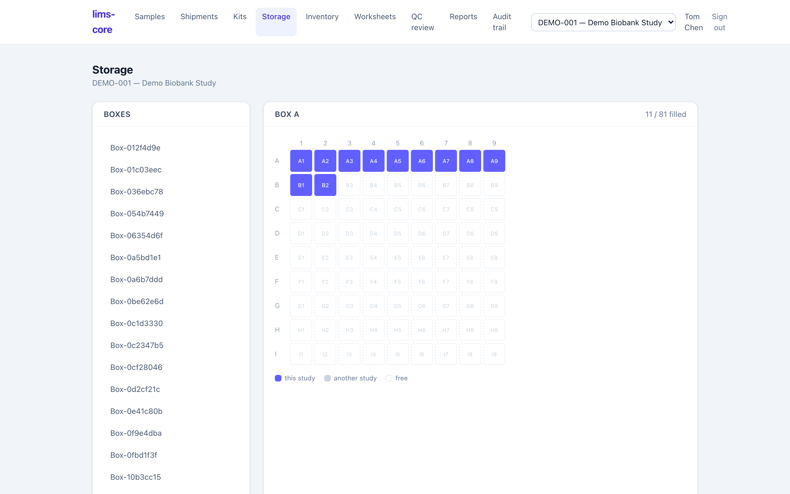

Once a specimen is accessioned, the sample record brings its whole physical
lifecycle onto one screen: a scannable label, a freezer position, and the
running chain of custody.

## The label

Every specimen gets a **2D DataMatrix label** encoding its accession ID,
alongside the human-readable ID for people. It is generated on demand and served
as a PNG, so it prints from any label printer without special drivers.

## Freezer storage

Storage is a hierarchy: facility → freezer → shelf → rack → box → position.
From a sample record you choose a box and either name a position (positions look
like `A1`) or leave it blank to auto-allocate the first free one. Each freezer
unit carries its temperature, so a −80 °C freezer is distinguishable from a
−20 °C one on the record.

The **Storage** screen shows any box as a grid, colouring each position by
whether it holds one of this study's specimens, another study's, or is free. You
can place a specimen by clicking a free position and move one by picking it up
and dropping it elsewhere; each move writes a `storage_remove` then
`storage_add` custody event, so the map is always backed by an unbroken trail
(ADR-0015).

The database enforces **one specimen per position**: a second specimen cannot be
booked into an occupied slot. This is a partial unique index, not an application
check, so it holds even under concurrent stores (requirement CoC-03).

## The chain of custody

Every physical event appends to an immutable custody log: collection and receipt
at accessioning, then storage, transfers between locations, aliquoting,
consent-withdrawal holds, and disposal. Custody rows can never be updated or
deleted; a correction is a new event, never an edit of an old one (requirement
CoC-02).

Because the log is append-only and scoped to the specimen's study, it is a
complete, tamper-evident answer to "where has this specimen been, and who
touched it?" With storage recorded, you can
[aliquot or derive the specimen](/lims-core/user-guide/biobank-operations/),
[ship it to a central lab](/lims-core/user-guide/shipments-and-kits/), or
[order a test and enter a result](/lims-core/user-guide/orders-and-results/).
